<!-- markdownlint-disable MD033 -->
# Goptivum

## Overview

**Goptivum** is a modern replacement for the legacy schedule generator program from Vulcan, named Optivum. It is designed to scrape schedule data from [zsem.edu.pl/plany](https://zsem.edu.pl/plany) and provide data persistence, an improved (definitely) UI/UX, and a publicly available API with Server-Sent Events (SSE). This project is intended to be used as a replacement for my school's version of the software, but can easily (the scraper package) be modified to work with other school's versions of that software.

> **Note**: Vulcan *(hawk-tuah)* is a **very evil** and **greedy** corporation and actively blocks open-source projects, making it difficult for developers to create alternatives to their poorly made software. For more information on this situation I suggest you visit this site [czyvulcanapojebalo.pl](https://czyvulcanapojebalo.pl/)

## Features

- **Data Scraping**: Scrapes schedule data from [zsem.edu.pl/plany](https://zsem.edu.pl/plany).
- **Data Persistence**: Ensures data availability even if the source site is down.
- **Modern UI/UX**: Provides a way better user interface and experience.
- **Public API**: Offers a publicly available API with SSE for real-time updates.

## Usage

You can currently use the application by visiting [zsem.smuggr.xyz](https://zsem.smuggr.xyz). Please note that the site may be down occasionally for maintenance as it is self-hosted.

## Deployment

To deploy GOptivum, you need to download a precompiled binary or compile it from source. The following tools are required:

- Go (version >1.23.1)
- Make
- Node.js
- Vite
- rsync (for deploying to the server)

> **Important**: Before using the `make deploy` command, edit the credentials in the `Makefile` to match your server setup.

## Steps to Deploy

### 1. Clone the Repository

```bash
git clone https://github.com/smugg99/goptivum.git
cd goptivum
```

### 2. Build the application

```bash
make
```

### 3. Deploy to Server

```bash
make deploy
```

## API Endpoints

The API provides several endpoints for accessing and managing schedule data, weather, and other related resources.

### Health Check

- **[GET] - `/api/v1/health/ping`** Returns a basic health check response to confirm the API is running.

---

### Schedule Data

#### Divisions

- **[GET] - `/api/v1/divisions/`** Retrieves the list of all divisions.
- **[GET] - `/api/v1/division/{index}`** Retrieves the schedule for a specific division by its index.

#### Teachers

- **[GET] - `/api/v1/teachers/`** Retrieves the list of all teachers.
- **[GET] - `/api/v1/teacher/{index}`** Retrieves the schedule for a specific teacher by their index.

#### Rooms

- **[GET] - `/api/v1/rooms/`** Retrieves the list of all rooms.
- **[GET] - `/api/v1/room/{index}`** Retrieves the schedule for a specific room by its index.

---

### Events

Provides real-time updates using **Server-Sent Events (SSE)**.

- **[GET] - `/api/v1/events/divisions`** Sends updates for divisions.
- **[GET] - `/api/v1/events/teachers`** Sends updates for teachers.
- **[GET] - `/api/v1/events/rooms`** Sends updates for rooms.

---

### Weather

- **[GET] - `/api/v1/weather/forecast`** Retrieves the weather forecast for the next 3 days.
- **[GET] - `/api/v1/weather/current`** Retrieves the current weather information.

---

### Air Quality

- **[GET] - `/api/v1/air/current`** Retrieves current air pollution data.

---

> **Note**:
> The API supports the `application/protobuf` response format for efficient data serialization. Clients can specify this format in the `Accept` header of their requests (JSON is the default format).
> Also, replace `{index}` with the specific index of the resource you want to query (e.g., division, teacher, or room).

## TODO for V1.1.0

- [ ] Enhance error handling and logging (including analytics) throughout the application.
- [ ] Optimize the deployment process and documentation.
- [ ] Implement user authentication and authorization for the API.
- [ ] Add more detailed API documentation and examples.
- [ ] Create a Dockerfile for easier deployment.

## Contributions

Contributions to the project are very welcome! If you can make the scraper more generic and capable of working with more versions of the Optivum software, it would be highly appreciated. Feel free to fork the repository, submit pull requests, or reach out with your ideas and improvements.

## Gallery

### Home

<div style="display: grid; grid-template-columns: 1fr 1fr; gap: 25px;">
    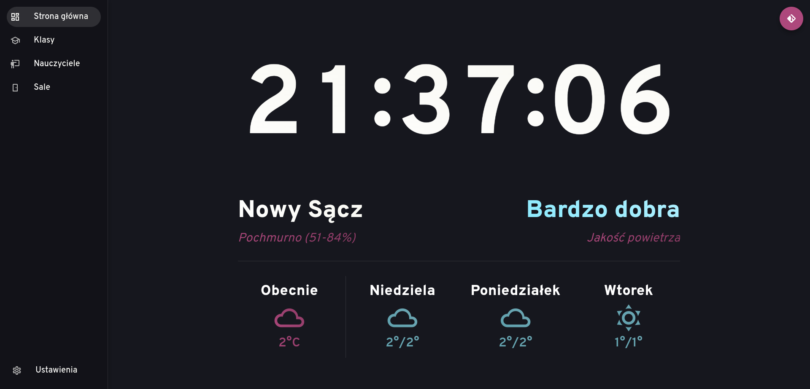
    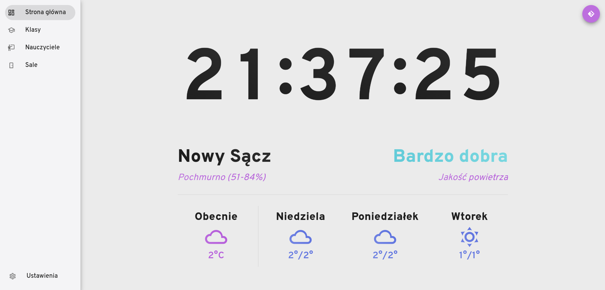
</div>

### Divisions List

<div style="display: grid; grid-template-columns: 1fr 1fr; gap: 25px;">
    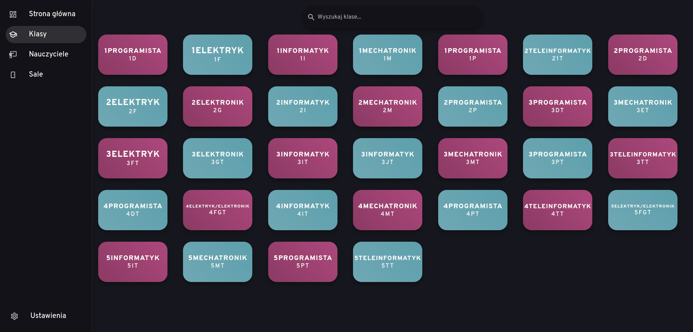
    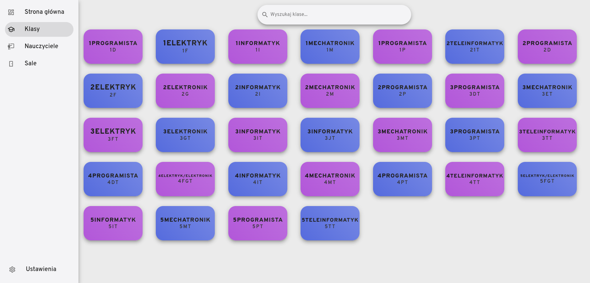
</div>

### Division Schedule

<div style="display: grid; grid-template-columns: 1fr 1fr; gap: 25px;">
    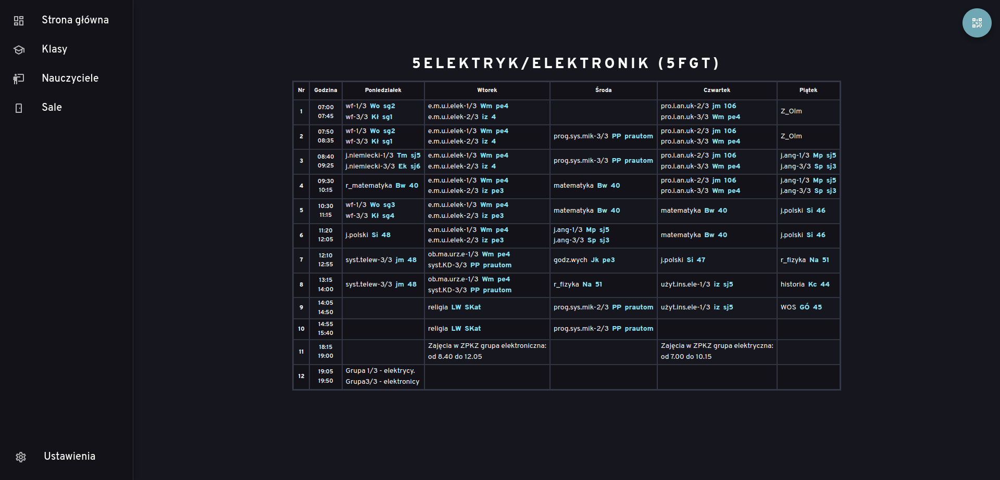
    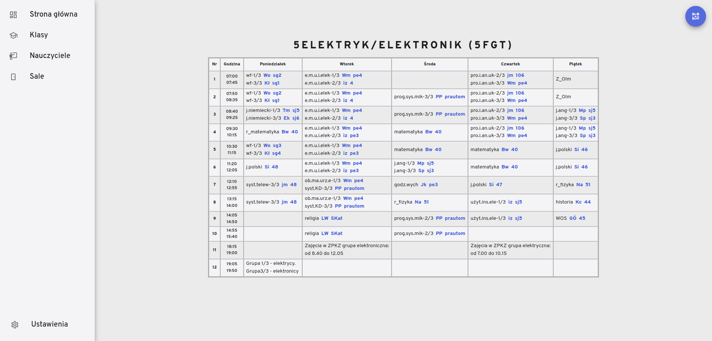
</div>

### Mobile Versions

<div style="display: grid; grid-template-columns: repeat(4, auto); justify-content: center; align-items: center; gap: 25px; padding: 0; margin: 0;">
    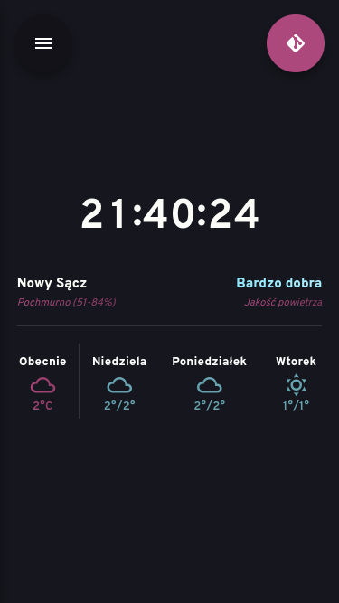
    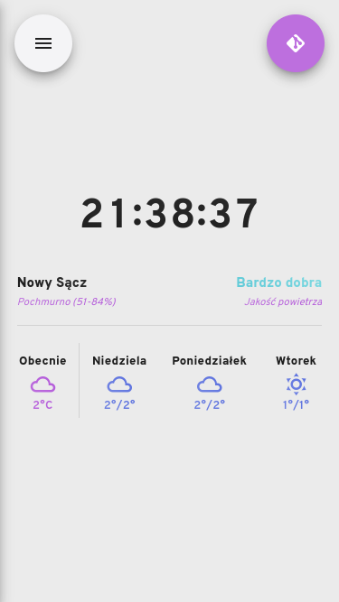
    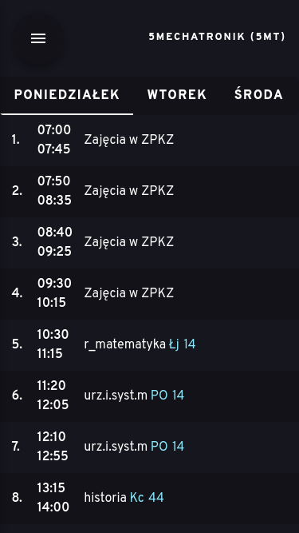
    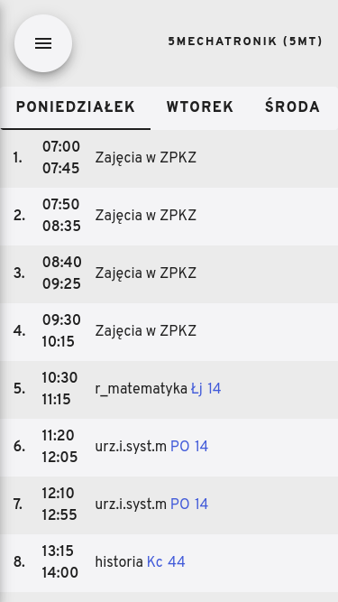
    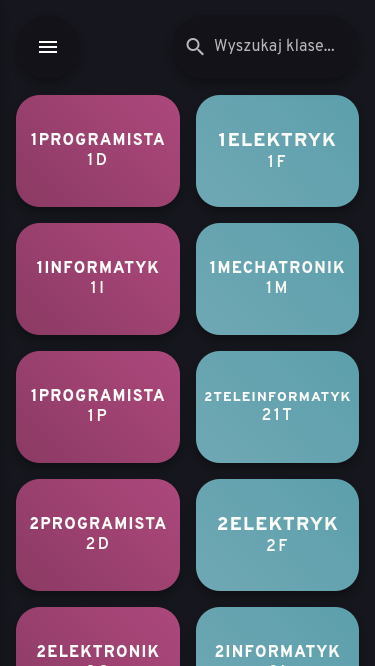
    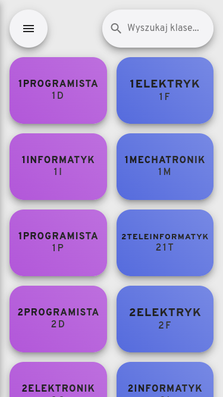
</div>

## License

This project is licensed under the MIT License. See the [LICENSE](./LICENSE) file for details.
